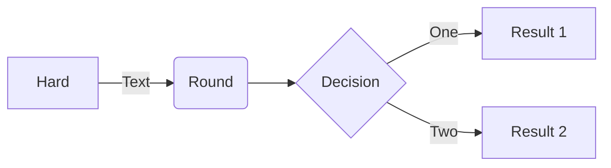
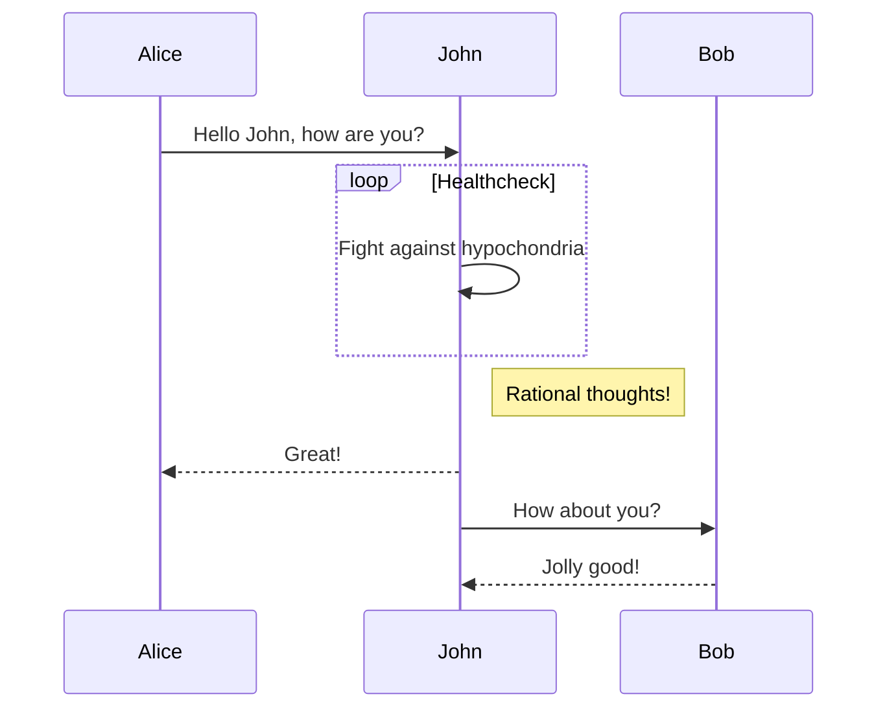
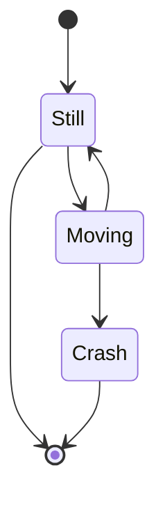

a link

https://google.com

or like this [link](https://yahoo.com)

## Sample

One more, finally. Or not? :)

Now:

```
$ some 
```

Look what she said:

> This is it!

### Subtitle

And now this:

- One
- Two
- Three


#### As well

#### As this

### Another

[a link](https://aws.com)

More?


Can we now have `the build`?

NOW!


Not gonna work, is it?

| table | header
| -     | -
| cell  | celllll
| asdf  | qwer

# mermaid






